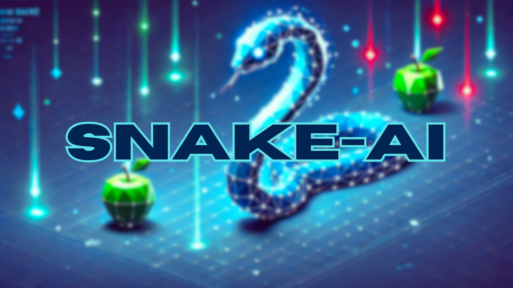
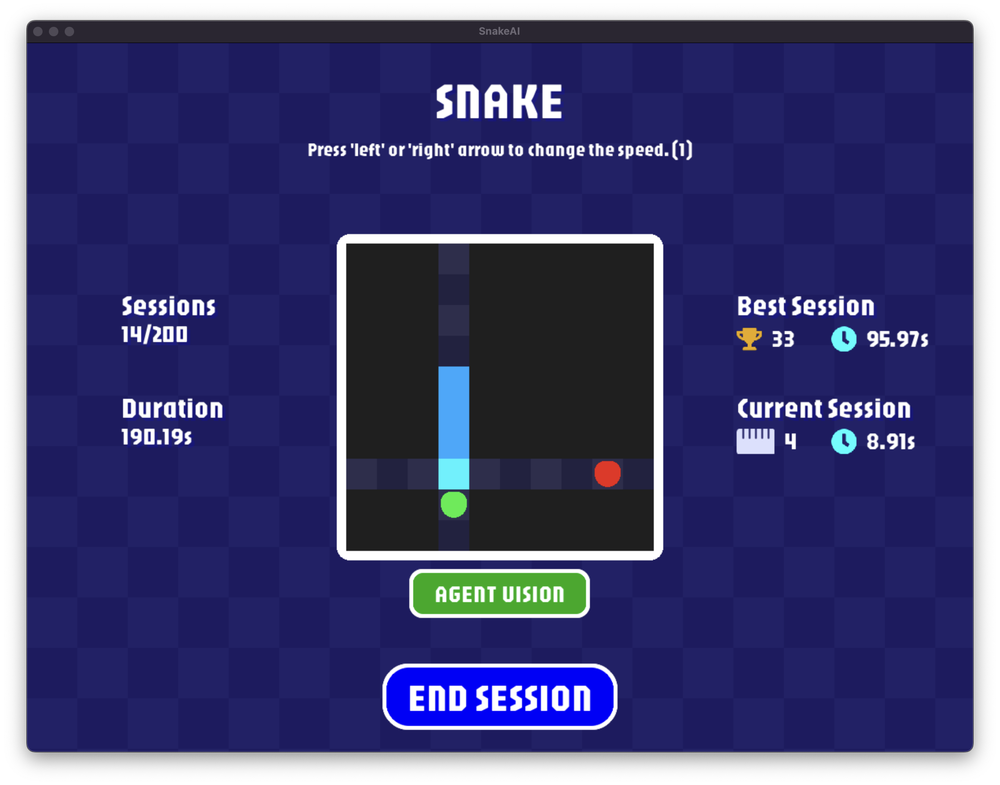
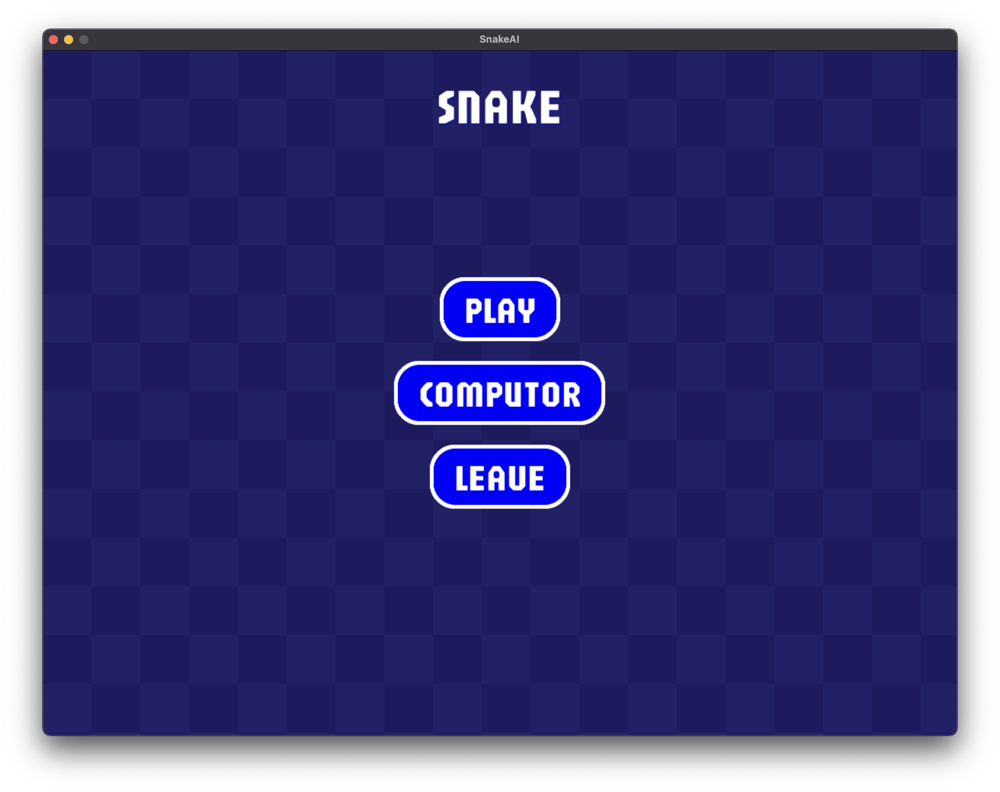
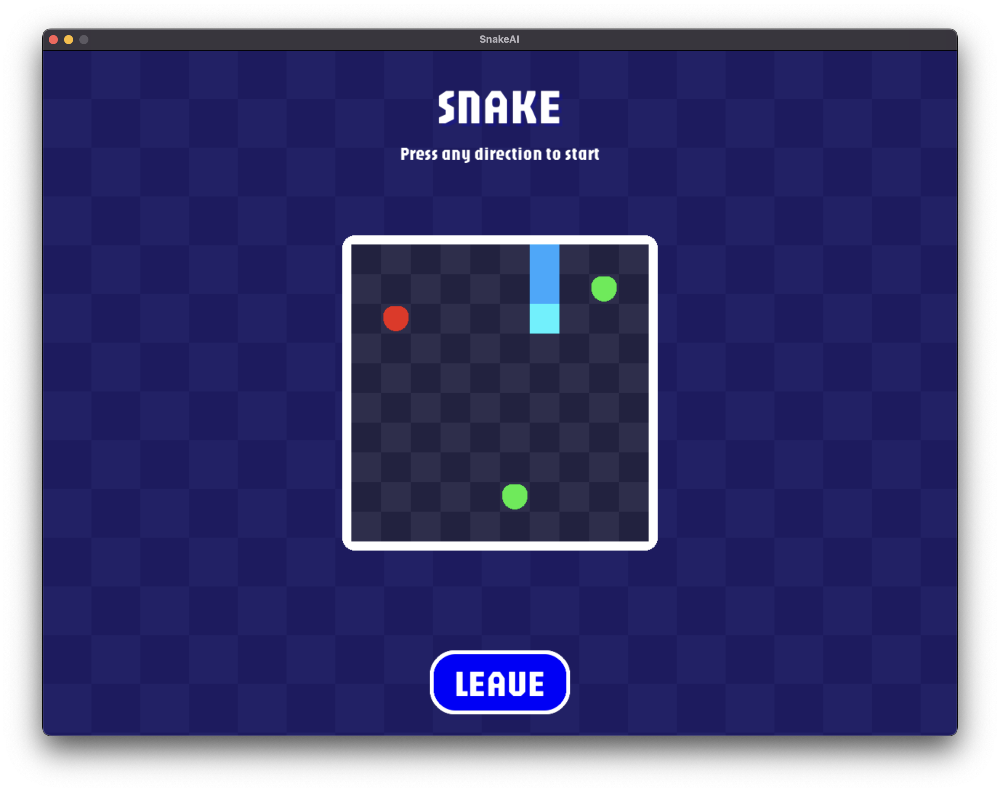
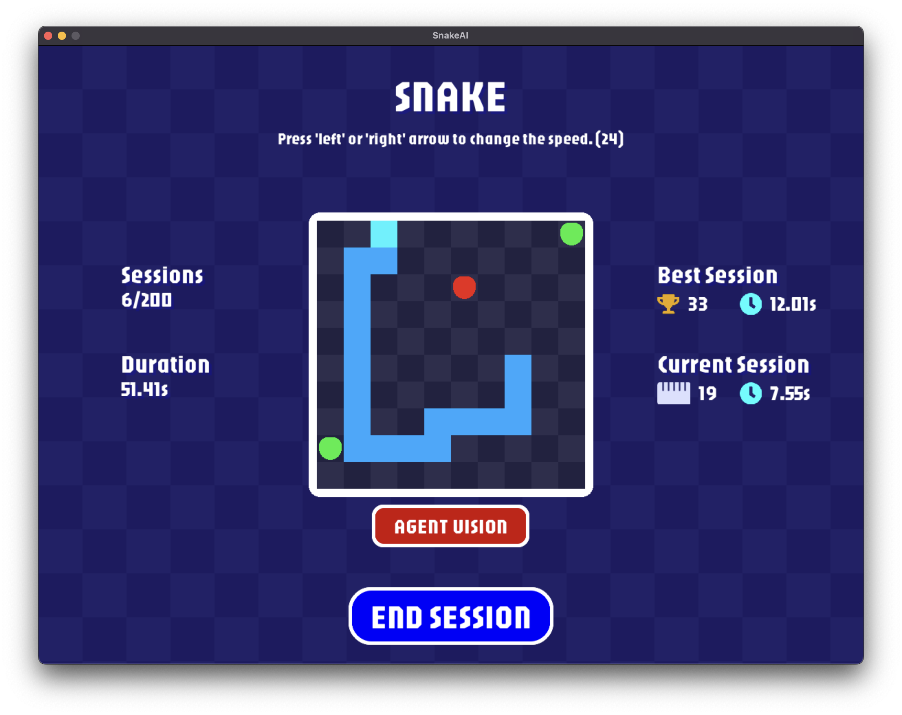
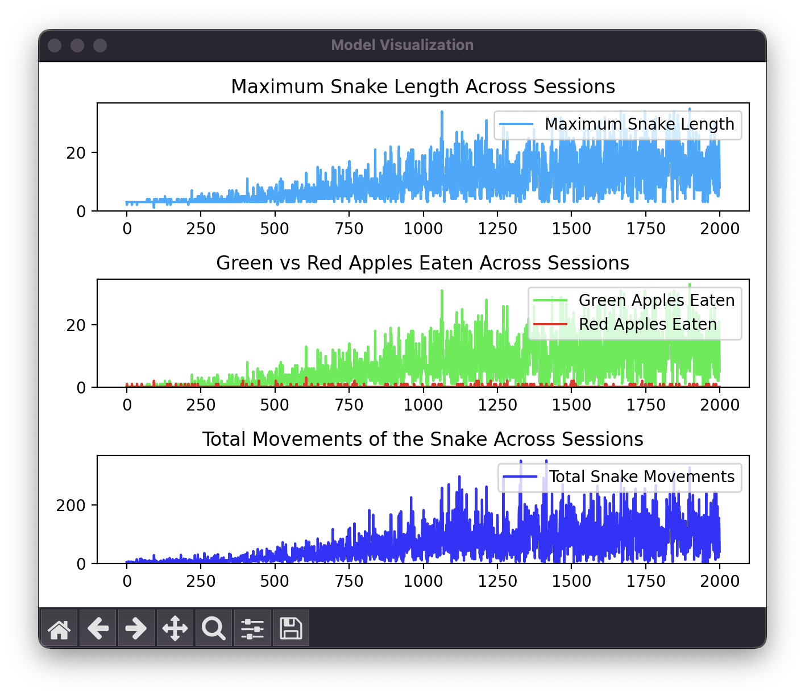
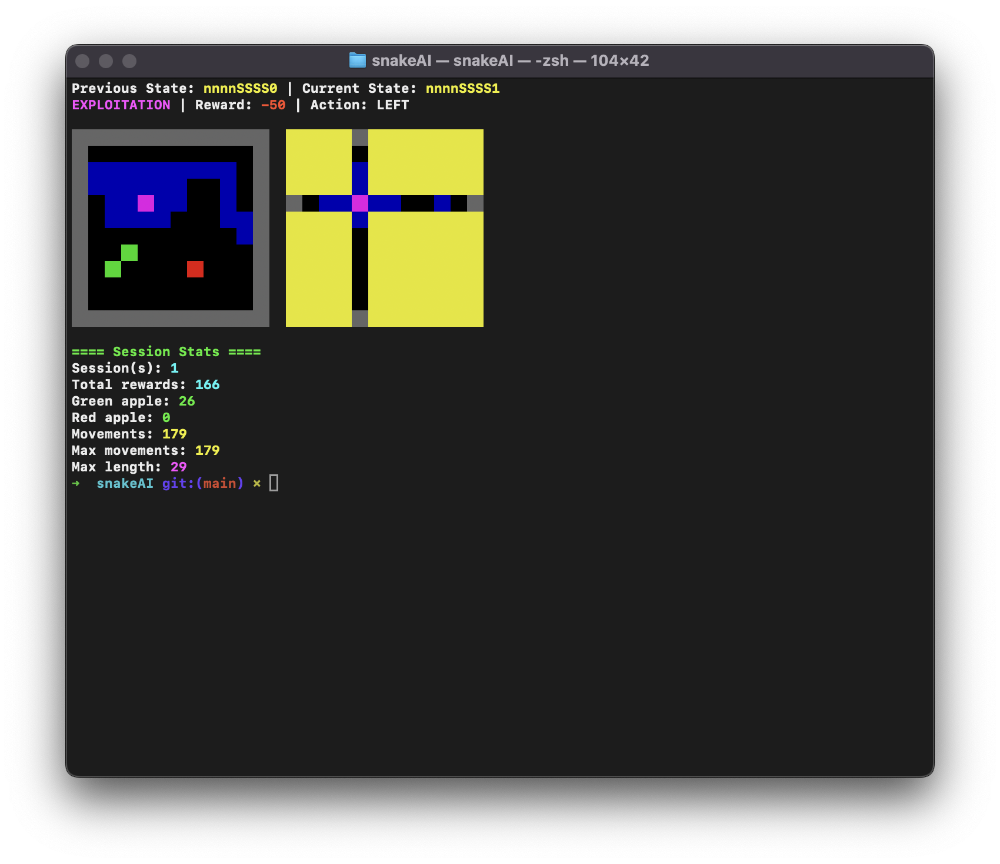

# snakeAI

<!-- [](https://github.com/DevJ2K/snakeAI) -->
<!-- [](https://github.com/DevJ2K/snakeAI/blob/main/README.md)
[](https://github.com/DevJ2K/snakeAI/blob/main/README-FR.md) -->




## 📄 Overview

The goal of this project is to introduce basic of reinforcement learning with a snake game. The snake has to reach a minimum length of 10.

## ❔ What's reinforcement learning ?

### Concept

The principle of reinforcement learning is to create an agent free to take actions within an environment. These actions alter the agent’s state, and this change in state is followed by a reward. For the agent, the goal is to maximize its rewards, which drives it to learn which actions to take to obtain the highest rewards.


### Case Study

Let’s imagine we are on a street, and I ask you this question:

- What is the __best restaurant__ where we can eat?

You will first identify which __street__ we are on. Let’s imagine we are on a street called __The Gourmet Avenue__. If you have never been on this street before, you won’t know how to answer.

Since we don’t have the answer, we decide to go to a random restaurant called __Burgir Restaurant__. Unfortunately, we find out that it’s not good at all. So, we note that when we were on __The Gourmet Avenue__, the __Burgir Restaurant__ was not a good choice.

The next day, we come back to the same street, and I ask you the same question. You still don’t know which is the best restaurant, but at least you know that __Burgir Restaurant__ should be avoided.

So, we decide to go to another restaurant called __Master Chicken__. This time, it turns out that this place is excellent. We then note that __Master Chicken__ on __The Gourmet Avenue__ is a very good choice.

Now, the next time I ask you the question, you will be able to tell me that the best restaurant you know on __The Gourmet Avenue__ is __Master Chicken__.

That said, nothing guarantees it’s the best restaurant, but based on our experience, it is. However, to truly know the best restaurant, we need to explore other places, try different restaurants, and not rely only on what we already know.

Because, imagine we go to another __street__ where we have never been, and I ask you the same question, the same initial problem will arise again.

This is exactly the principle of reinforcement learning. To avoid being in a situation where you cannot answer, you need to try new restaurants on other streets. After a while, you will be able to more or less answer the question on any street. But for that, you’ll need to test a lot of restaurants...

### Summary

In this scenario:
- __We__ are the __agent__.
- __Eating at a location__ is an __action__.
- The __street__ and the __restaurant__ characterize a __state__.
- Our __opinions__ about the __locations__ represent the __rewards__.

For the agent to achieve the best results, it must learn by visiting different states, and in each state, it receives either a positive or a negative reward. This is what allows it to build its experiences and make decisions later on.


## 👓 Snake Vision (State)

The snake can only see in the 4 directions from its head. The following image represents the snake vision.



## 🏆 Rewards

The goal of the agent is to reach at least a length of 10 cells, and stay alive as long as possible. The action chosen by the agent will evolve through time in order to reach this goal, based on rewards granted by the environment (or board) after each action.
- ✅ __(+20)__: If the snake eats a green apple.
- ❎ __(-20)__: If the snake eats a red apple.
- ❎ __(-2)__: If the snake eats nothing.
- ❎ __(-50)__: If the snake is Game over (hit a wall, hit itself, null length).

The reward for each action will increase or decrease the chance for the agent to make
the same choice in the future when facing an identical situation.

## ☑️ Action

The agent can only perform 4 actions:
- ⬆️ __Up__
- ⬇️ __Down__
- ⬅️ __Left__
- ➡️ __Right__

It must take decisions solely based on the snake vision, from the head and to the 4 directions.
No other information from the board are used by the agent.

## 📚 Environnement/Board

- Board size 10 cells by 10 cells. (Adjustable)
- Two green apples, in a random cell of the board.
- One red apple, in a random cell of the board.
- The snake starts with a length of 3 cells, also placed randomly and contiguously on
the board.
- If the snake hits a wall: Game over, this training session ends.
- If the snake collides with its own tail: Game over, this training session ends.
- The snake eats a green apple: snake’s length increase by 1. A new green apple
appears on the board.
- The snake eats a red apple: snake’s length decrease by 1. A new red apple appears
on the board.
- If the snake’s length drops to 0: Game over, this training session ends.

## 📝 Features

- ✅ Play a fully functional snake game.
- ✅ Visualize the model's training process.
- ✅ View detailed graphs of training sessions.
- ✅ Run the application via the command line interface (CLI).
- ✅ Customize the board size for the agent.
- ✅ Adjust the snake's speed for better visualization.
- ✅ Observe the snake's vision in real-time.


## 📦 Installation

Ensure you have Python 3.9 or newer. Download the latest version of Python from the official [Python website](https://www.python.org/downloads/).

1. **Clone the Repository:**

    ```bash
    git clone https://github.com/DevJ2K/snakeAI.git
    cd snakeAI
    ```

2. **(Optional) Create a Virtual Environment:**

    It’s recommended to use a virtual environment for managing dependencies.

    ```bash
    python3 -m venv venv
    source venv/bin/activate  # On Windows use `venv\Scripts\activate`
    ```

3. **Install Dependencies:**

    If dependencies are listed in `requirements.txt`, install them with:

    ```bash
    pip install -r requirements.txt
    ```

## 🏁 Usage

### Use the window

- **Make the script executable:**

   ```bash
    chmod +x game.py
    ```

    Then execute it directly:

    ```bash
    ./game.py
    ```

- **Using the Python command:**

    ```bash
    python3 game.py
    ```

#### Expected Output

<!--  -->

### Use the CLI

- **Make the script executable:**

   ```bash
    chmod +x main.py
    ```

    Then execute it directly:

    ```bash
    ./main.py -h
    ```

- **Using the Python command:**

    ```bash
    python3 main.py -h
    ```

#### Expected Output

```
usage: main.py [-h] [-sessions SESSIONS] [-board BOARD] [-speed SPEED]
               [-load LOAD] [-save [SAVE]] [-visual {on,off}] [-dontlearn]
               [-step-by-step] [-graph-only]

A reinforcement learning-based snake game where the agent learns to improve
its performance.

options:
  -h, --help          show this help message and exit
  -sessions SESSIONS  Number of training sessions to execute. Defaults to 1.
  -board BOARD        Size of the square board (e.g., 10 for a 10x10 grid).
                      Defaults to 10.
  -speed SPEED        Speed of the snake in seconds per step when
                      visualization is enabled. Defaults to 0.1.
  -load LOAD          Path to a pre-trained model file to load for testing or
                      further training.
  -save [SAVE]        Path to save the trained model after the session. The
                      model will be stored in the specified file.
  -visual {on,off}    Toggle visualization of the snake's actions and
                      decision-making process ('on' or 'off').
  -dontlearn          Run the game without training to evaluate the current
                      model's performance.
  -step-by-step       Enable step-by-step mode, requiring the user to press
                      'Enter' to advance each step.
  -graph-only         Display only the training statistics of the model in a
                      graph without running.
```

## 📸 Visuals from the Project





